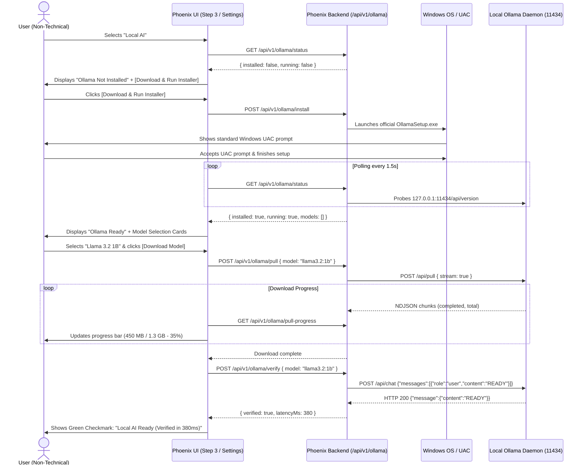

# Phoenix Phase 3: Ollama & Local AI Productization Plan (Revised)

**Date:** 2026-09-08  
**Status:** REVISED & PROPOSED (Pending User Review & Authorization)  
**Target:** Transparent, Honest, Consumer-Friendly Local AI Setup for Windows

---

## 1. Executive Summary & Core Objective

Transform Phoenix's local AI setup from a developer-operated subsystem into a transparent, dependable consumer experience for non-technical Windows users.

### The Guiding Principle: Absolute Truth in Readiness
Phoenix must eliminate the "ready model" discrepancy identified in the audit. Phoenix will **never** declare a model "READY" if the production chat path will return HTTP 404. Readiness must represent verifiable, end-to-end reality on the user's actual hardware.

---

## 2. Plan Revisions (Addressing Review Requirements)

| Requirement Area | Previous Plan Flaw | Revised Plan Commitment |
|---|---|---|
| **1. Lifecycle Ownership** | Assumed Phoenix would supervise and own Ollama like an internal child worker. | **Detect & Use External First**: Phoenix checks for an already-running Ollama instance (tray app or service) and attaches as a client. Never terminates an existing external process. Only spawns `ollama serve` if Ollama is installed, inactive, and explicitly requested by the user. |
| **2. Download Controls** | Claimed byte-level "pause/resume" functionality. | **Accurate Cancel Action**: Removed pause claims. Implements clean **Cancel** via `AbortController`. Accurately documents that Ollama retains verified layer blobs in `%USERPROFILE%\.ollama\models\blobs\`, allowing layer-level resumption if re-initiated. |
| **3. Model Metadata** | Hardcoded fixed download sizes (1.3 GB, 2.0 GB) and RAM requirements as permanent facts. | **Dynamic & Labeled Estimates**: Installed models read exact sizes from Ollama's API (`size` in bytes). Recommended models display labeled estimates (e.g. `~1.3 GB download (estimate)`, `~2.5 GB RAM footprint (estimate)`). No misleading guarantees like "will run smoothly." |
| **4. Installer Flow** | Implied unattended background installation. | **User-Controlled Installation**: Phoenix launches the official `OllamaSetup.exe` installer with the user retaining complete control over Windows UAC prompts. Phoenix passively polls for installation completion. |
| **5. Model Recommendations** | Embedded recommendations into server logic and migrations. | **Isolated Catalog Module**: Recommendations live in an independent data module (`service/src/models-catalog.js`) that can be updated or swapped without modifying core supervisor or database logic. |
| **6. Readiness Truth** | Allowed fabricated substitution ("using llama3.2 substituted") while DB remained out of sync. | **Zero Fake Readiness**: `selected_model` is strictly `READY` only when Ollama is reachable, the configured model exists in local catalog, and live test inference succeeds. Otherwise honestly reports `NEEDS_ACTION` or `UNAVAILABLE`. |
| **7. Real Chat Path Verification** | Relied only on direct Ollama `/api/chat` API test. | **Production Pipeline Verification**: Acceptance criteria requires a real chat query through Phoenix's full production LLM stack (`askAI` / production router) confirming local execution. |
| **8. Privacy Labeling** | Broad privacy claims regardless of runtime fallback. | **Honest Privacy Metadata**: UI and logs state "Local & Private" only when the response was actually served locally on `127.0.0.1:11434`. If cloud fallback triggers, UI explicitly displays "External Provider: <Name>". |

---

## 3. Ollama Lifecycle Ownership Rules & Conflict Handling

### Ownership States
1. **`EXTERNAL_UNMANAGED` (Default)**:
   - Ollama is already running on `127.0.0.1:11434` (e.g. started via Windows Startup, Ollama tray app `ollama app.exe`, or manually by the user).
   - **Rule:** Phoenix treats it as an external HTTP service. Phoenix connects as an HTTP client, reads models, and issues chat/embedding requests.
   - **Rule:** Phoenix **MUST NEVER** attempt to stop, restart, or kill an external Ollama process when Phoenix shuts down or reloads.
2. **`PHOENIX_MANAGED` (On-Demand Spawn)**:
   - Ollama binary is installed on disk, but port 11434 is closed.
   - When the user selects Local AI or clicks "Start Local AI Engine", Phoenix spawns `ollama.exe serve` (or launches the Windows app).
   - Phoenix records the child process ID.
   - **Rule:** When Phoenix exits, it will not abruptly kill Ollama if Ollama is serving background tasks, unless explicitly configured to do so.
3. **Conflict Handling**:
   - If port 11434 is already open when startup is attempted, Phoenix aborts the spawn and connects to the existing listener.
   - If port 11434 is occupied by an unresponsive process, Phoenix reports: `"Port 11434 is in use but not responding. Please check your Ollama background app."` Phoenix will **never** execute `taskkill /F /IM ollama.exe`.

---

## 4. Confirmed Reusable vs. Missing Components

### Reusable Components (Unmodified Core Architecture)
1. **`service/src/readiness.js`**: Structured 8-component reporting schema (`READY`, `NEEDS_ACTION`, `UNAVAILABLE`, `DISABLED`).
2. **`service/src/db.js`**: `model_selections` table schema, `getModelForPurpose`, `setModelForPurpose`, `getOllamaUrl`.
3. **`service/src/llm.js`**: `askAI` with `ollama:` prefix routing via `/api/chat`.
4. **`service/src/llm-fallback.js`**: Fallback chain mechanism catching network and model errors.
5. **`service/dashboard` (SvelteKit)**: Modern Svelte 5 / runes components for reactive UI and progress bars.
6. **`service/tauri`**: Native Windows shell, window management, and background supervisor.

### Components to Create / Refactor
1. **Isolated Model Catalog (`service/src/models-catalog.js`)**:
   - Decoupled registry of recommended models, labeled requirement estimates, and purpose tags (`chat`, `embedding`, `vision`).
2. **Centralized Ollama Lifecycle Engine (`service/src/ollama-manager.js`)**:
   - Detection, safe on-demand launch, official installer launcher, streaming model download with cancellation, and live test inference.
3. **Ollama REST API Endpoints (`service/src/server.js`)**:
   - `GET /api/v1/ollama/status`: Reports binary presence, running state, ownership (`EXTERNAL` vs `MANAGED`), and installed models.
   - `POST /api/v1/ollama/start`: Safely starts daemon if stopped.
   - `POST /api/v1/ollama/install`: Downloads and triggers official Windows installer.
   - `POST /api/v1/ollama/pull`: Initiates model pull.
   - `GET /api/v1/ollama/pull-progress`: Returns current download state (bytes completed, total bytes, speed, status).
   - `POST /api/v1/ollama/pull-cancel`: Cancels active pull via `AbortController`.
   - `POST /api/v1/ollama/verify`: Tests live inference on a specific model.
   - `POST /api/v1/ollama/select`: Updates `model_selections` and validates presence.
4. **Interactive Setup UI (`service/dashboard/src/routes/setup/+page.svelte`)**:
   - Step 3: Interactive Local AI setup card with automated status detection, guided install, model picker, and live progress bar.
   - Step 7: System readiness badges with honest status.
5. **Consumer Settings Panel (`service/dashboard/src/routes/settings/+page.svelte`)**:
   - Replaces manual text fields with a clear Local AI status card and model manager.

---

## 5. Exact Implementation Sequence

### Phase 3.1: Isolated Model Catalog (`service/src/models-catalog.js`)
Create an independent configuration module providing:
```javascript
export const RECOMMENDED_MODELS = [
  {
    id: 'llama3.2:1b',
    name: 'Llama 3.2 1B',
    tag: 'llama3.2:1b',
    purpose: 'chat_local',
    recommended: true,
    description: 'Fast, lightweight on-device assistant',
    estimatedDownloadSize: '~1.3 GB (estimate)',
    estimatedMemoryUsage: '~2.5 GB RAM (estimate)',
    minRecommendedRamGb: 8,
  },
  {
    id: 'llama3.2:3b',
    name: 'Llama 3.2 3B',
    tag: 'llama3.2:3b',
    purpose: 'chat_local',
    recommended: false,
    description: 'Higher reasoning quality for capable hardware',
    estimatedDownloadSize: '~2.0 GB (estimate)',
    estimatedMemoryUsage: '~4.5 GB RAM (estimate)',
    minRecommendedRamGb: 12,
  },
  {
    id: 'qwen2.5:1.5b',
    name: 'Qwen 2.5 1.5B',
    tag: 'qwen2.5:1.5b',
    purpose: 'chat_local',
    recommended: false,
    description: 'Compact multilingual model',
    estimatedDownloadSize: '~1.0 GB (estimate)',
    estimatedMemoryUsage: '~2.0 GB RAM (estimate)',
    minRecommendedRamGb: 8,
  }
];
```
*Note: Any updates to recommendations or estimates require editing only this isolated file, with zero modifications to server, supervisor, or database code.*

### Phase 3.2: Ollama Manager (`service/src/ollama-manager.js`)
Implement:
1. **`detectOllama()`**:
   - Probes `http://127.0.0.1:11434/api/version`.
   - If responding -> `running: true, ownership: 'EXTERNAL_UNMANAGED'`.
   - If not responding -> checks binary at `%LOCALAPPDATA%\Programs\Ollama\ollama.exe`, `%ProgramFiles%\Ollama\ollama.exe`, or `where ollama`.
2. **`startOllamaDaemon()`**:
   - If already running, returns `{ ok: true, alreadyRunning: true }`.
   - Spawns `ollama.exe serve` (or launches `ollama app.exe`) detached.
   - Polls `127.0.0.1:11434/api/version` every 500ms up to 15 seconds.
   - Marks ownership as `PHOENIX_MANAGED`.
3. **`launchOfficialInstaller()`**:
   - Downloads `https://ollama.com/download/OllamaSetup.exe` to `%TEMP%\OllamaSetup.exe`.
   - Spawns `OllamaSetup.exe` with standard Windows execution.
   - Returns `{ ok: true, message: 'Installer launched. Please follow the on-screen setup prompts.' }`.
4. **`pullModelStream(modelName)`**:
   - Maintains an active download state object: `{ active: true, model: modelName, completed: 0, total: 0, percent: 0, status: 'pulling manifest', abortController }`.
   - Reads streaming NDJSON from `POST http://127.0.0.1:11434/api/pull`.
   - Updates progress on each chunk.
   - Catches `AbortError` cleanly when canceled.
5. **`cancelPull()`**:
   - Calls `activePull.abortController.abort()`.
   - Cleans up state: `{ active: false, canceled: true }`.
6. **`testModelInference(modelName)`**:
   - Sends minimal prompt to `http://127.0.0.1:11434/api/chat`:
     `{ model: modelName, messages: [{ role: 'user', content: 'Respond with the single word: READY' }], stream: false }`.
   - Timeout: 20,000ms.
   - Verifies HTTP 200, valid text response, and calculates actual response latency.

### Phase 3.3: REST API Surface (`service/src/server.js`)
Mount endpoints:
- `GET /api/v1/ollama/status` -> Returns binary status, running status, installed models with actual disk sizes, and recommended models catalog.
- `POST /api/v1/ollama/start` -> Starts daemon.
- `POST /api/v1/ollama/install` -> Launches installer.
- `POST /api/v1/ollama/pull` -> Starts pull job.
- `GET /api/v1/ollama/pull-progress` -> Polls pull progress.
- `POST /api/v1/ollama/pull-cancel` -> Cancels active pull.
- `POST /api/v1/ollama/verify` -> Tests live inference.
- `POST /api/v1/ollama/select` -> Validates model presence in Ollama and updates `model_selections` table (`purpose='chat_local'`).

### Phase 3.4: Readiness Engine Alignment (`service/src/readiness.js`)
- Remove the heuristic that fabricated substitution.
- `selected_model` check:
  ```javascript
  const sel = getModelForPurpose('chat_local');
  const installedModel = ollamaProbe.models.find(m => m.name === sel?.model);
  if (!installedModel) {
    return {
      label: 'Selected AI Model',
      status: 'NEEDS_ACTION',
      message: `Selected model "${sel?.model || 'none'}" is not installed in Ollama`,
      details: { configured: sel?.model, installed: ollamaProbe.models.map(m => m.name) }
    };
  }
  // Model exists in local Ollama catalog
  return {
    label: 'Selected AI Model',
    status: 'READY',
    message: `Local model ready (${installedModel.name})`,
    details: { model: installedModel.name, sizeBytes: installedModel.size }
  };
  ```

### Phase 3.5: Database Seed Auto-Alignment (`service/src/db.js`)
- If existing database contains `gemma4:e2b` in `model_selections`, migrate:
  - If Ollama is running and has any installed chat models, set `chat_local` to the first valid model.
  - Otherwise set default seed to `llama3.2:1b` (our recommended primary).
  - Never leave a known nonexistent model in `model_selections`.

### Phase 3.6: Onboarding UI Productization (`setup/+page.svelte`)
- **Step 3 ("Choose Your AI Engine")**:
  - Selecting "Local AI" reveals a live status card:
    - **State 1: Ollama Not Installed**:
      - Message: *"Ollama is not installed on this PC."*
      - Button: **[Download & Run Ollama Installer]**.
      - Action: Triggers `/api/v1/ollama/install`. Polls for detection.
    - **State 2: Ollama Installed but Inactive**:
      - Message: *"Ollama is installed but not running."*
      - Button: **[Start Local AI Engine]**.
      - Action: Triggers `/api/v1/ollama/start`. UI transitions automatically upon detection.
    - **State 3: Ollama Running, No Model**:
      - Visual model selection cards from `RECOMMENDED_MODELS`.
      - Clear labels: *Llama 3.2 1B — ~1.3 GB download (estimate), requires ~2.5 GB RAM (estimate)*.
      - Button: **[Download Selected Model]**.
    - **State 4: Downloading Model**:
      - Progress bar showing percentage, downloaded MB / total MB, and transfer status.
      - Button: **[Cancel Download]**.
    - **State 5: Model Ready & Verified**:
      - Shows green checkmark with actual model name and size.
      - Button: **[Run Quick Test]** -> verifies live generation with response latency.
- **Step 7 ("System Readiness Check")**:
  - Displays honest status badges.
  - If `selected_model` is `NEEDS_ACTION`, provides direct action button (e.g. "Select Model" or "Download Model").

### Phase 3.7: Settings Panel Productization (`settings/+page.svelte`)
- Replaces raw technical inputs in "AI & Usage" tab with a consumer Local AI management section:
  - Status indicator (Active / Inactive / Not Installed).
  - Dropdown of currently installed models.
  - "Download New Model" accordion with progress tracking.
  - Verification button to test local inference on demand.

---

## 6. User-Facing UX Flow



---

## 7. Error States & Transparent Handling

1. **User Cancels Download**:
   - Clicking **[Cancel Download]** aborts the HTTP stream. Progress bar disappears, and UI returns cleanly to the model selection state.
   - Ollama keeps verified layer blobs in its local store; restarting the download later naturally skips completed layers.
2. **Network Connection Loss**:
   - If stream breaks, UI displays: `"Download interrupted. Check your internet connection."`
   - Button: **[Retry Download]**.
3. **Insufficient Disk Space**:
   - Check available disk space before download. If free space is below twice the estimated download size, warn: `"Low disk space. Recommended: at least 3 GB free."`
4. **Port 11434 Conflict**:
   - If an unrecognized process holds port 11434 and does not answer `/api/version`, display: `"Port 11434 is in use by another application."` Never issue forceful process kills.
5. **Slow CPU Inference / Cold Start**:
   - When running test inference or first prompt, display: `"Warming up local AI model..."`
   - Test inference timeout is generous (20s) with clear failure messaging if exceeded.

---

## 8. Security & Privacy Safeguards

1. **Honest Privacy Metadata**:
   - The UI and system logs may only display `"100% Private Local AI"` when the request was physically executed on `127.0.0.1:11434`.
   - If fallback to an external API (Cerebras, Anthropic, Gemini) occurs, the response metadata and UI must explicitly state `"Processed by External Provider: <Name>"`.
2. **Official Installer Integrity**:
   - Installer is sourced exclusively from official `https://ollama.com/download/OllamaSetup.exe`.
   - User reviews and confirms the standard Windows UAC elevation.
3. **No Secret Leakage**:
   - Local Ollama requires no API keys; any cloud fallback keys remain encrypted in SQLite and redacted from API responses.
4. **Local Data Boundaries**:
   - Local database (`phoenix.db`), encryption keys, and vectors remain strictly on the local machine.

---

## 9. Verification & Acceptance Criteria

### A. Automated Test Suite
Create `service/src/__tests__/ollama-manager.test.js`:
1. **Catalog Integrity Test**: Verifies `models-catalog.js` exports required fields (id, name, tag, purpose, estimates) without syntax errors.
2. **Detection Test**: Verifies `detectOllama()` accurately distinguishes between missing binary, stopped binary, and active port.
3. **Lifecycle Ownership Test**: Verifies that when an external instance is active, Phoenix attaches as client and does NOT issue shutdown or termination commands.
4. **Pull Stream Parser & Cancellation Test**: Mocks NDJSON stream from Ollama, verifies progress updates, and tests `cancelPull()` abort behavior.
5. **Readiness Alignment Test**: Verifies `readiness.js` reports `NEEDS_ACTION` when the configured model does not exist in local catalog, and `READY` only when model exists and passes test.

### B. Manual Real-Executable Verification (`Phoenix.exe`)
*All manual verification must be performed using the real compiled desktop binary `Phoenix.exe`.*

1. **Step 3 Interactive Verification**:
   - Launch `Phoenix.exe` on fresh database.
   - Navigate to Step 3, choose "Local AI".
   - Verify that Ollama's actual state is detected (if stopped, clicking "Start Engine" launches it without opening a terminal window).
   - If model is missing, verify download card shows estimated size and clicking download presents real-time progress.
   - Verify cancellation works cleanly if clicked.
   - Verify model download completes and test inference returns green checkmark with response latency.
2. **Step 7 Readiness Verification**:
   - Advance to Step 7.
   - Verify `local_ai` is `READY` and `selected_model` is `READY` with the exact model downloaded.
   - Verify zero fabricated substitution messages.
3. **CRITICAL ACCEPTANCE TEST: Production Chat Path Verification**:
   - Complete onboarding and enter the Phoenix main interface.
   - Send a real chat prompt through the production chat interface.
   - **Confirm that the response is generated by the local Ollama model.**
   - Confirm zero 404 errors in the console or logs.
   - Confirm that the request did NOT silently fall back to cloud.
4. **Process Cleanup & Orphan Verification**:
   - Close `Phoenix.exe`.
   - Verify external Ollama process is NOT killed.
   - Verify zero orphan Phoenix processes remain.

---

## 10. Rollback Considerations

- If any issue arises during Phase 3, existing fallback chains (`llm-fallback.js`) and keyword search (`embedFallback` + SQLite FTS) remain completely intact and unaffected.
- No irreversible database schema changes; `model_selections` columns are preserved.
- Model catalog is completely isolated in `service/src/models-catalog.js`.
